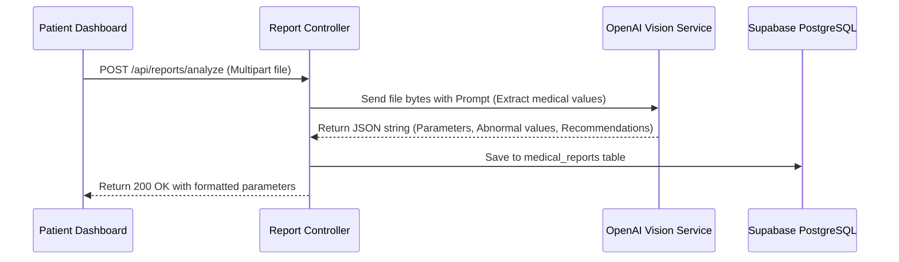

# Architecture: AI Health Risk Prediction System 2.0 (PulseMind)

This document describes the high-level architecture, design decisions, and system interactions for the upgraded PulseMind Platform.

## 🏗️ System Overview

PulseMind is structured as a **modular three-tier web application** designed for production scaling, local testing simplicity, and high-fidelity rendering.

```
┌────────────────────────────────────────────────────────┐
│                   Presentation Layer                   │
│   React 18 (Vite + TS + Tailwind + Framer Motion)      │
│   - Patient UI (Analytics, Chat, Planners, Reminders)  │
│   - Doctor UI (Alert Console, Patient Directory, Notes)│
│   - Admin UI (System monitoring, Logs, Metrics)        │
└───────────────────────────┬────────────────────────────┘
                            │ HTTPS (REST API / SSE Streams)
┌───────────────────────────▼────────────────────────────┐
│                   Application Layer                    │
│   Spring Boot 3.2.4 API (Web, JPA, Security, AI)       │
└──────┬────────────────────┬─────────────────────┬──────┘
       │ JDBC               │ HTTP REST           │ Multipart Upload
┌──────▼───────┐     ┌──────▼──────┐       ┌──────▼──────┐
│  Data Layer  │     │ AI Engines  │       │ OCR Parser  │
│   Supabase   │     │ (Spring AI  │       │ (OpenAI     │
│  PostgreSQL  │     │   OpenAI)   │       │ Vision API) │
└──────────────┘     └─────────────┘       └─────────────┘
```

---

## 🔌 Core Component Architectures

### 1. Presentation Layer (Frontend)
- **Framework**: React 18, scaffolded with Vite and styled via Tailwind CSS.
- **Dynamic Animations**: `framer-motion` handles page changes, menu transitions, slide-out drawers, and alert popups.
- **Charts & Histograms**: `recharts` plots longitudinal vitals, prediction score changes, calorie ratios, and SHAP feature importances.
- **Folder Structure**:
  - `src/theme`: Holds the brand palette configurations (Sage, Mint, Cream, Coral) utilizing custom Tailwind tokens and CSS variables.
  - `src/features`: Grouped features (e.g. `ai` for chat and symptom checks, `dashboard` for visual health metrics, `profile` for lifestyle data).
  - `src/components/ui`: Custom styled buttons, select controls, skeletal templates, drawers, and modal blocks.

### 2. Application Layer (Backend)
- **Framework**: Spring Boot 3.2.4 running on Java 21.
- **Spring Security & JWT**: Validates stateless tokens via `JwtAuthenticationFilter`, parsing permissions based on roles (`PATIENT`, `DOCTOR`, `ADMIN`).
- **AI Processing (Spring AI / OpenAI)**:
  - **Symptom Triage**: Parses natural language entries, extracts clinical metrics, assigns urgency tiers, and suggests checkups.
  - **Medical Report Analyzer**: Multi-part upload handler. Extracts lab data from images or documents via OpenAI's Vision API and outputs clean JSON analysis.
  - **Conversation Store**: Manages conversation history cache indexed by username to feed context back into model queries.
  - **Lifestyle Generators**: Combines profile facts (Age, BMI, conditions) to output meal plans and exercise regimes.
- **Asynchronous Task Schedulers**: Triggers alerts and notification logs for upcoming medicine dosages.

### 3. Data Layer (Supabase PostgreSQL)
- **Relational Tables**: JPA models represent the database state. Custom schemas are created dynamically on first boot.
- **Pool Management**: Uses HikariCP configured to connect safely to Supabase poolers.

---

## 🔄 Core Pipelines

### 1. Medical Report Parser Pipeline


### 2. Explainable AI (SHAP Visualization) Pipeline
1. **Request**: Patient submits vitals for diabetes/heart evaluation.
2. **Analysis**: Service runs model predictions and computes input variances against baseline stats.
3. **Weight Computation**: Calculates feature importance coefficients (e.g., Glucose +30%, Age +10%, Skin Thickness -5%) and stores this array as a JSON string in `feature_importance`.
4. **Display**: React front-end parses `feature_importance` and renders a horizontal bar chart of positive/negative health contributors.
