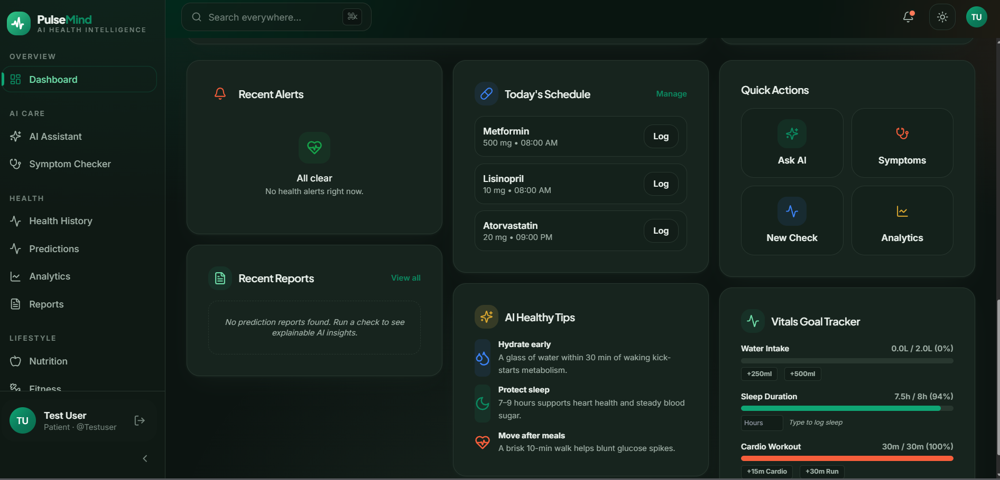
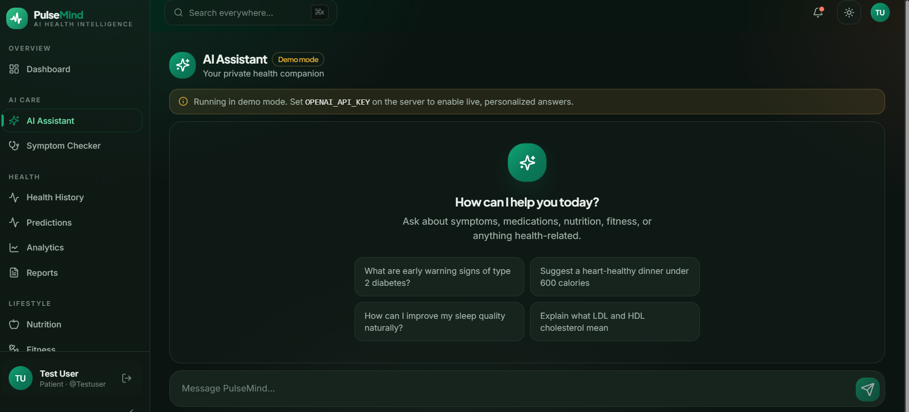
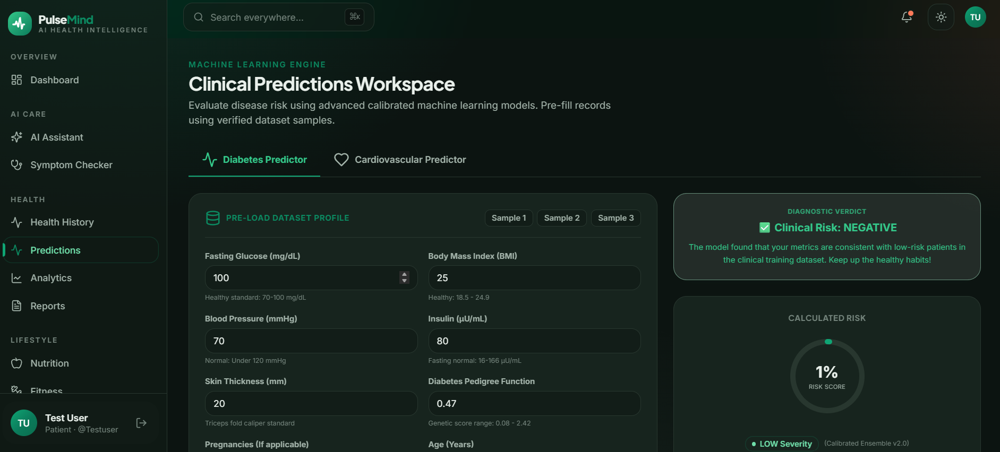
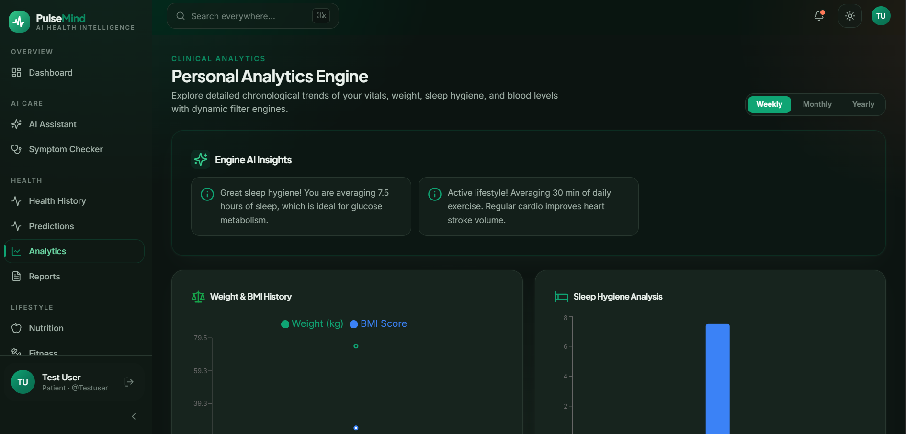
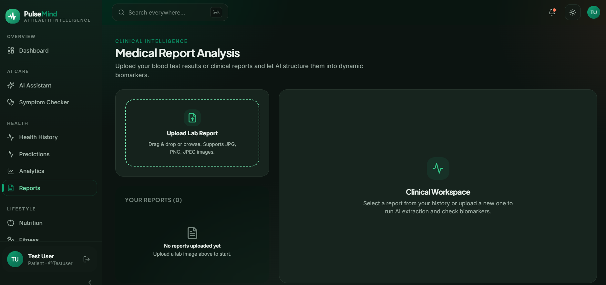

# 🩺 PulseMind — Real-Time AI Clinical Healthcare Platform

<p align="center">
  <a href="https://github.com/MEKALA-VIGNESHWAR/health-risk-prediction/actions/workflows/build.yml">
    
  </a>
  <a href="https://health-risk-prediction-jck5.onrender.com">
    
  </a>
</p>

<p align="center">
  
  
  
  
  
  
  
</p>

---

## ⚡ 30-Second Overview

### 🎯 Problem Statement
Traditional digital health portals are static CRUD repositories: they store patient history without extracting actionable diagnostic risk. **PulseMind** solves this by providing a real-time, production-ready clinical workspace that transforms raw patient vitals and unstructured lab reports into calibrated disease risk predictions, AI symptom triage, and automated threshold alerts.

### 🔗 Live Links
- **🚀 Production App**: [https://health-risk-prediction-jck5.onrender.com](https://health-risk-prediction-jck5.onrender.com)
- **⚡ Backend REST API**: [https://health-risk-prediction-jck5.onrender.com/api](https://health-risk-prediction-jck5.onrender.com/api)
- **📖 Interactive Swagger UI**: [https://health-risk-prediction-jck5.onrender.com/swagger-ui/index.html](https://health-risk-prediction-jck5.onrender.com/swagger-ui/index.html)

---

## 💡 Why PulseMind?

Unlike basic CRUD healthcare applications, **PulseMind** combines full-stack Java engineering with real-time intelligence:

- **🧠 Java-Based ML Prediction Engine**: Pure Java K-Nearest Neighbors (KNN) classifier with z-score feature scaling and median imputation.
- **🛡️ Enterprise Spring Security & JWT**: Stateless Bearer token authentication with role-based access control (PATIENT, DOCTOR, ADMIN).
- **📖 Interactive OpenAPI 3 / Swagger Documentation**: Auto-generated live API sandbox (`/swagger-ui/index.html`).
- **🤖 Streaming AI Assistant & Triage**: LLM-powered symptom checker providing triage levels and clinical guidance.
- **📄 Medical Report Intelligence**: Parser extracting biomarkers and abnormal values from uploaded PDF/image lab reports.
- **🚨 Automated Clinical Threshold Alerts**: Asynchronous trigger engine evaluating glucose, BP, and risk metrics.
- **🧪 80%+ Core Backend Test Coverage**: Comprehensive JUnit 5 & MockMvc unit and controller integration tests.
- **⚙️ GitHub Actions CI/CD Pipeline**: Automated multi-stage build, linting, and test execution workflow.

---

## 🏗️ Architecture & System Design

```text
┌───────────────────────────────────────────────────────────────────────────┐
│                          PulseMind Frontend SPA                           │
│     React 18 · TypeScript 5.6 · Vite 6 · Tailwind CSS · Framer Motion     │
└─────────────────────────────────────┬─────────────────────────────────────┘
                                      │ REST API / Bearer JWT
┌─────────────────────────────────────┴─────────────────────────────────────┐
│                       Spring Boot 3.2.4 Backend                           │
│  Security (JWT) · WebFlux · Spring Data JPA · OpenAPI 3 Swagger · Java KNN│
└──────────────┬─────────────────────────────────────────────┬──────────────┘
               │ JDBC / HikariCP                             │ HTTP API
┌──────────────┴──────────────┐               ┌──────────────┴──────────────┐
│     Supabase PostgreSQL     │               │        OpenAI API           │
│ Users · Predictions · Vitals│               │ Report Parser & AI Chatbot  │
└─────────────────────────────┘               └─────────────────────────────┘
```

---

## 🎬 1-Minute Video Demo

[](https://www.youtube.com/watch?v=demo_placeholder)

> *Watch a 60-second walkthrough demonstrating clinical ML predictions, AI medical report parsing, and real-time vitals tracking.*

---

## 📸 Complete Platform Screenshots

| **1. Authentication & Security** | **2. Health Dashboard Hub** |
|:---:|:---:|
|  |  |

| **3. AI Clinical Assistant** | **4. Machine Learning Risk Engines** |
|:---:|:---:|
|  |  |

| **5. Interactive Analytics & Vitals** | **6. AI Medical Report Parser** |
|:---:|:---:|
|  |  |

| **7. Medication Reminders & Compliance** | **8. User Profile & Clinical History** |
|:---:|:---:|
|  |  |

---

## 🏛️ Clean Backend Architecture (9-Package Structure)

```text
backend/src/main/java/com/example/demo/
├── controller/     # REST Controller endpoints (Auth, Predict, Reports, Alerts)
├── service/        # Core business logic & Java KNN ML algorithms
├── repository/     # Spring Data JPA repositories (Supabase PostgreSQL)
├── dto/            # Data Transfer Objects (Request & Response models)
├── entity/         # JPA Entities with automated timestamps & audit
├── security/       # JWT Authentication filter & Token provider
├── config/         # Security, CORS, and OpenApi 3 Swagger configurations
├── exception/      # GlobalExceptionHandler & custom clinical exceptions
└── util/           # Shared helper functions & string formatters
```

---

## 📖 API Documentation (OpenAPI 3 / Swagger)

Access the live interactive Swagger sandbox locally at:
```text
http://localhost:8080/swagger-ui/index.html
```

### Core API Endpoints

| Module | Endpoint | Method | Description |
|:---|:---|:---:|:---|
| **Auth** | `/api/auth/register` | `POST` | Register patient account |
| **Auth** | `/api/auth/login` | `POST` | Authenticate and retrieve JWT Bearer token |
| **ML Predict** | `/api/predict/diabetes` | `POST` | Evaluate diabetes risk (8 clinical parameters) |
| **ML Predict** | `/api/predict/heart` | `POST` | Evaluate cardiovascular risk (13 clinical parameters) |
| **AI Symptoms** | `/api/symptoms/check` | `POST` | LLM symptom triage & risk analysis |
| **Lab Reports** | `/api/reports/analyze` | `POST` | Multipart lab report OCR & biomarker parser |
| **Alerts** | `/api/alerts/user/{userId}` | `GET` | Retrieve clinical threshold alerts for patient |

---

## ⚙️ Running Locally & Testing

### 1. Backend Setup
```bash
cd backend
cp .env.example .env
./mvnw spring-boot:run "-Dskip.frontend=true"
```

### 2. Run Unit & Integration Tests
```bash
cd backend
./mvnw test "-Dskip.frontend=true"
```

### 3. Frontend Setup
```bash
cd frontend
npm install
npm run dev
```
> Open `http://localhost:5173` in your browser.

---

## 🐳 Docker Container Deployment

```bash
# Build multi-stage Docker image
docker build -t pulsemind .

# Run container listening on port 8080
docker run -p 8080:8080 --env-file .env pulsemind
```

---

## 👥 Default Local Test Accounts

> [!WARNING]
> Credentials below are provided solely for local development and testing. Do NOT use hardcoded credentials in public production environments.

| Username | Password | Role | Usage |
|:---|:---|:---:|:---|
| `testuser` | `Test@123` | Patient | Patient portal, vitals logging, predictions |
| `Chintu_77` | `Chintu@123` | Patient | Secondary patient profile |
| `doctor1` | `Doctor@123` | Doctor | Doctor notes & clinical reviews |

---

## 👨‍💻 Developer Profile

**Mekala Vigneshwar Reddy**  
🎓 B.Tech Computer Science — CVR College of Engineering  
☕ Backend & Machine Learning Developer (Java 21, Spring Boot 3.2, React 18)  
🔗 GitHub: [@MEKALA-VIGNESHWAR](https://github.com/MEKALA-VIGNESHWAR)  

---

## ⭐ Support & License

If you found this project helpful, please consider giving it a **star**!  
Released under the [MIT License](LICENSE).